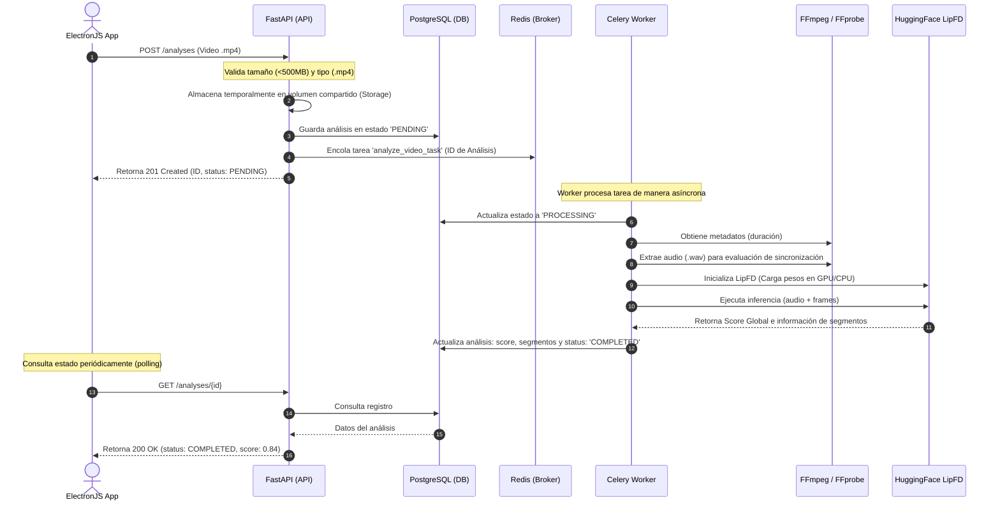

# Arquitectura del Backend - Detección de Deepfakes (LipFD)

Este documento detalla la arquitectura, flujos de datos, diseño de base de datos e instrucciones de despliegue para el backend de detección de deepfakes en sincronización labial utilizando el modelo **LipFD**.

---

## 1. Diagrama de Arquitectura Hexagonal

El backend está diseñado siguiendo los principios de la **Arquitectura Hexagonal (Puertos y Adaptadores)** para aislar la lógica de negocio (Dominio y Aplicación) de los frameworks externos y detalles de infraestructura (FastAPI, SQLAlchemy, Celery, FFmpeg).

```mermaid
graph TD
    subgraph Interfaces (Adaptadores de Entrada)
        API[FastAPI Controllers]
        Routes[API Routes]
        Schemas[Pydantic Validation]
    end

    subgraph Application (Orquestación)
        Services[Use Cases: Submit, Get, List]
        Tasks[Celery Background Tasks]
    end

    subgraph Domain (Núcleo de Negocio)
        Entities[Entities: Analysis]
        VO[Value Objects: AnalysisStatus]
        Exc[Domain Exceptions]
        Ports[Ports / Interfaces: Repo, Storage, VideoProc, ModelInference]
    end

    subgraph Infrastructure (Adaptadores de Salida)
        RepoImpl[SQLAlchemy Repositories]
        StorageImpl[Local disk storage / aiofiles]
        VideoProcImpl[FFmpeg CLI Adapter]
        ModelImpl[HuggingFace LipFD Adapter / PyTorch]
        DB[(PostgreSQL)]
        Redis[(Redis Queue & Cache)]
    end

    %% Relaciones / Sentido de las dependencias
    Routes --> Services
    Services --> Entities
    Services --> Ports
    Tasks --> Ports
    
    RepoImpl -.-> Ports
    StorageImpl -.-> Ports
    VideoProcImpl -.-> Ports
    ModelImpl -.-> Ports

    RepoImpl --> DB
    Tasks --> Redis
```

---

## 2. Responsabilidad de las Capas

### Capa de Dominio (`app/domain`)
El núcleo del sistema. No depende de ningún framework, biblioteca ORM o infraestructura.
*   **[entities.py](file:///home/alyc3/SGTC_Fronted/backend/app/domain/entities.py)**: Define la entidad de negocio `Analysis` con sus reglas de estado e invariantes.
*   **[value_objects.py](file:///home/alyc3/SGTC_Fronted/backend/app/domain/value_objects.py)**: Objetos sin identidad propia, como el enum de estados `AnalysisStatus`.
*   **[exceptions.py](file:///home/alyc3/SGTC_Fronted/backend/app/domain/exceptions.py)**: Excepciones de negocio (`AnalysisNotFoundError`, `VideoProcessingError`).
*   **[ports.py](file:///home/alyc3/SGTC_Fronted/backend/app/domain/ports.py)**: Interfaces abstractas (`AnalysisRepository`, `ModelInferencePort`, `VideoProcessor`, `FileStoragePort`) que la infraestructura debe implementar.

### Capa de Aplicación (`app/application`)
Implementa los casos de uso específicos de la aplicación orchestrando las entidades del dominio y los puertos.
*   **[services.py](file:///home/alyc3/SGTC_Fronted/backend/app/application/services.py)**: Casos de uso como `SubmitVideoAnalysis` (guarda archivo, registra en base de datos e inicia tarea en background), `GetAnalysisResult` y `ListAnalyses`.
*   **[tasks.py](file:///home/alyc3/SGTC_Fronted/backend/app/application/tasks.py)**: Tareas de Celery que controlan el pipeline asíncrono de detección.

### Capa de Infraestructura (`app/infrastructure`)
Contiene los adaptadores concretos para interactuar con tecnologías externas.
*   **Persistencia (`persistence/`)**: Configuración asíncrona de SQLAlchemy 2.0 y repositorios concretos que consultan PostgreSQL.
*   **Inferencia del Modelo (`model_inference/`)**: Implementa el adaptador del modelo `LipFD` cargando pesos desde HuggingFace o memoria local.
*   **Procesamiento de Video (`video_processing/`)**: Adaptador que envuelve comandos de `ffmpeg` y `ffprobe` en subprocesses asíncronos.
*   **Almacenamiento de Archivos (`file_storage/`)**: Escribe videos en el disco de manera asíncrona utilizando `aiofiles`.

### Capa de Interfaces (`app/interfaces`)
Define la interfaz HTTP expuesta.
*   **[api.py](file:///home/alyc3/SGTC_Fronted/backend/app/interfaces/api.py)**: Configuración del servidor FastAPI y políticas de CORS.
*   **[routes.py](file:///home/alyc3/SGTC_Fronted/backend/app/interfaces/routes.py)**: Endpoints HTTP públicos (subida de video, consulta de estado, listado y healthcheck).
*   **[schemas.py](file:///home/alyc3/SGTC_Fronted/backend/app/interfaces/schemas.py)**: Esquemas de validación de datos Pydantic.
*   **[dependencies.py](file:///home/alyc3/SGTC_Fronted/backend/app/interfaces/dependencies.py)**: Inyector manual de dependencias conectando los adaptadores de infraestructura a los servicios.

---

## 3. Diagrama de Secuencia del Flujo de Detección



---

## 4. Guía de Instalación y Ejecución con Docker Compose

### Requisitos Previos
*   Docker y Docker Compose instalados en el sistema host.
*   En caso de querer usar aceleración de hardware por GPU (opcional), tener configurado Nvidia Container Toolkit. El adaptador por defecto cae en modo CPU si no hay CUDA.

### Paso 1: Configurar Variables de Entorno
Copia el archivo `.env.example` y renómbralo a `.env`. Configura los valores correspondientes:
```bash
cp .env.example .env
```
Si el modelo de HuggingFace requiere token de autorización para descarga, configúralo en la variable `HF_TOKEN`.

### Paso 2: Levantar el Entorno de Contenedores
Ejecuta el siguiente comando para construir las imágenes de la API y el Worker de Celery, y arrancar todos los servicios (PostgreSQL, Redis, API, Worker):
```bash
docker-compose up --build -d
```

### Paso 3: Ejecutar Migraciones de Base de Datos
Una vez que el contenedor de PostgreSQL esté saludable, ejecuta las migraciones iniciales de Alembic para crear las tablas correspondientes:
```bash
docker-compose exec api alembic upgrade head
```

### Paso 4: Validar Funcionamiento
Puedes verificar que la API esté funcionando correctamente accediendo al endpoint de salud:
```bash
curl http://localhost:8000/health
```
La respuesta esperada es:
```json
{
  "status": "healthy",
  "database": "healthy"
}
```

---

## 5. Descripción de Endpoints

### 1. Healthcheck
*   **Ruta**: `/health`
*   **Método**: `GET`
*   **Descripción**: Verifica el estado de salud de la API y su conectividad con PostgreSQL.
*   **Códigos de Estado**:
    *   `200 OK`: El backend y la base de datos están operativos.
    *   `500 Internal Server Error`: La base de datos no está disponible.
*   **Respuesta de Ejemplo**:
    ```json
    {
      "status": "healthy",
      "database": "healthy"
    }
    ```

### 2. Subida de Video para Análisis
*   **Ruta**: `/analyses`
*   **Método**: `POST`
*   **Descripción**: Recibe un archivo de video en formato multipart, lo guarda en el volumen compartido, registra el análisis en la base de datos y dispara la tarea asíncrona de procesamiento.
*   **Restricciones**:
    *   Formatos soportados: `.mp4`, `.avi`, `.mov`, `.mkv`
    *   Tamaño máximo: 500 MB (Configurable a través del campo `MAX_VIDEO_SIZE_BYTES` en `.env`)
*   **Cuerpo de la Petición**: Multipart Form Data conteniendo el campo `file` con el binario del video.
*   **Códigos de Estado**:
    *   `201 Created`: Análisis registrado y tarea encolada.
    *   `400 Bad Request`: Formato no soportado, archivo vacío o corrupto.
    *   `413 Request Entity Too Large`: El archivo excede el límite configurado.
*   **Respuesta de Ejemplo**:
    ```json
    {
      "id": "f81d4fae-7dec-11d0-a765-00a0c91e6bf6",
      "original_filename": "video_prueba.mp4",
      "storage_path": "uploads/a1b2c3d4e5f6.mp4",
      "duration": null,
      "status": "pending",
      "deepfake_score": null,
      "segments_result": [],
      "created_at": "2026-07-09T23:55:00",
      "updated_at": "2026-07-09T23:55:00"
    }
    ```

### 3. Obtener Resultado por ID
*   **Ruta**: `/analyses/{analysis_id}`
*   **Método**: `GET`
*   **Descripción**: Obtiene los detalles completos y estado actual del análisis solicitado.
*   **Códigos de Estado**:
    *   `200 OK`: Retorna el objeto del análisis.
    *   `404 Not Found`: El ID proporcionado no corresponde a ningún análisis registrado.
*   **Respuesta de Ejemplo (Completado)**:
    ```json
    {
      "id": "f81d4fae-7dec-11d0-a765-00a0c91e6bf6",
      "original_filename": "video_prueba.mp4",
      "storage_path": "uploads/a1b2c3d4e5f6.mp4",
      "duration": 12.4,
      "status": "completed",
      "deepfake_score": 0.8562,
      "segments_result": [
        {
          "segment_index": 0,
          "start_time": 0.0,
          "end_time": 2.0,
          "deepfake_score": 0.123,
          "status": "authentic",
          "audio_visual_sync_error": 0.02
        },
        {
          "segment_index": 1,
          "start_time": 2.0,
          "end_time": 4.0,
          "deepfake_score": 0.954,
          "status": "manipulated",
          "audio_visual_sync_error": 0.32
        }
      ],
      "created_at": "2026-07-09T23:55:00",
      "updated_at": "2026-07-09T23:55:03"
    }
    ```

### 4. Listar Análisis con Filtros
*   **Ruta**: `/analyses`
*   **Método**: `GET`
*   **Descripción**: Devuelve una lista de análisis ordenados por fecha de creación descendente, aplicando filtros opcionales.
*   **Parámetros de Consulta**:
    *   `status` (opcional): Filtra por estado (`pending`, `processing`, `completed`, `failed`).
    *   `min_score` (opcional): Filtra puntuaciones mayores o iguales a este valor (0.0 a 1.0).
    *   `max_score` (opcional): Filtra puntuaciones menores o iguales a este valor (0.0 a 1.0).
    *   `limit` (opcional, default 50): Límite de elementos a retornar para paginación.
    *   `offset` (opcional, default 0): Desplazamiento para paginación.
*   **Códigos de Estado**:
    *   `200 OK`: Lista de análisis encontrados.
*   **Respuesta de Ejemplo**:
    ```json
    [
      {
        "id": "f81d4fae-7dec-11d0-a765-00a0c91e6bf6",
        "original_filename": "video_prueba.mp4",
        "storage_path": "uploads/a1b2c3d4e5f6.mp4",
        "duration": 12.4,
        "status": "completed",
        "deepfake_score": 0.8562,
        "segments_result": [...],
        "created_at": "2026-07-09T23:55:00",
        "updated_at": "2026-07-09T23:55:03"
      }
    ]
    ```

---

## 6. Guía para el Desarrollador: Modificación de Componentes

### Cómo Cambiar o Agregar un Nuevo Modelo de Inferencia
El pipeline del backend interactúa con el modelo a través de la abstracción `ModelInferencePort` en la capa de dominio. Para cambiar o agregar un nuevo modelo:

1.  **Definir la Implementación**: Crea un nuevo adaptador en `app/infrastructure/model_inference/` (por ejemplo, `nuevo_modelo_adapter.py`). Esta clase debe heredar de `ModelInferencePort` e implementar el método obligatorio:
    ```python
    from app.domain.ports import ModelInferencePort

    class NuevoModeloAdapter(ModelInferencePort):
        async def run_inference(self, video_path: str, audio_path: Optional[str] = None) -> Tuple[float, List[Dict[str, Any]]]:
            # Lógica de inferencia propia
            return score, segments
    ```
2.  **Registrar la Dependencia**: Modifica `app/interfaces/dependencies.py` (o la tarea de Celery en `app/application/tasks.py`) para instanciar e inyectar el nuevo adaptador en lugar del de LipFD:
    ```diff
    - from ..infrastructure.model_inference.lipfd_adapter import LipFDAdapter
    + from ..infrastructure.model_inference.nuevo_modelo_adapter import NuevoModeloAdapter
    ```

### Cómo Modificar el Pipeline de Procesamiento en Tareas de Celery
La lógica secuencial de procesamiento reside en el caso de uso orquestado por Celery en `app/application/tasks.py`. Si necesitas agregar un paso de procesamiento (como extracción de rostros previos, mejora de contraste, o reducción de ruido en el audio):

1.  **Declarar Puerto**: Añade una nueva firma de método en `VideoProcessor` (dentro de `app/domain/ports.py`) para la nueva operación.
2.  **Implementar en Adaptador**: Escribe el código en `app/infrastructure/video_processing/ffmpeg_adapter.py` utilizando FFmpeg o una herramienta específica (como OpenCV).
3.  **Llamar en Tarea**: Modifica la función `async_analyze_video` en `app/application/tasks.py` incorporando el nuevo método en el flujo secuencial y propagando los resultados correspondientes al modelo.

---

## 7. Notas de Integración con ElectronJS

Dado que la interfaz de usuario se construirá con ElectronJS, se deben tener en cuenta las siguientes consideraciones para la comunicación con el backend:

### Cabeceras CORS
El backend está configurado con `CORSMiddleware` permitiendo todos los orígenes (`allow_origins=["*"]`). Esto es fundamental porque las aplicaciones de Electron se ejecutan bajo esquemas de archivos locales (`file://`) o servidores de desarrollo (`http://localhost:3000`), lo cual suele disparar bloqueos CORS si no está configurado explícitamente en el backend.

### Flujo de Trabajo Recomendado para el Frontend (ElectronJS)
1.  **Subida de Archivos**: El frontend debe realizar una petición `POST` multipart a `/analyses` enviando el archivo de video. Se recomienda mostrar un loader de subida en la interfaz.
2.  **Recepción de ID de Análisis**: Al recibir la respuesta exitosa (con estado `201 Created` e ID de análisis), guardar el ID en el estado local de la interfaz.
3.  **Polling de Estado**: Realizar peticiones `GET` periódicas a `/analyses/{id}` (por ejemplo, cada 2 o 3 segundos) para monitorizar el campo `status`.
    *   Si es `pending` o `processing`, mantener la animación de carga.
    *   Si cambia a `completed`, detener el polling y pintar los resultados (score y tabla de segmentos evaluados).
    *   Si cambia a `failed`, notificar el error al usuario.
4.  **Uso de Evidencias**: Si se habilita la extracción de frames específicos catalogados como deepfakes en los metadatos de los segmentos, se pueden servir mediante un volumen compartido o endpoints estáticos en FastAPI en iteraciones futuras.
